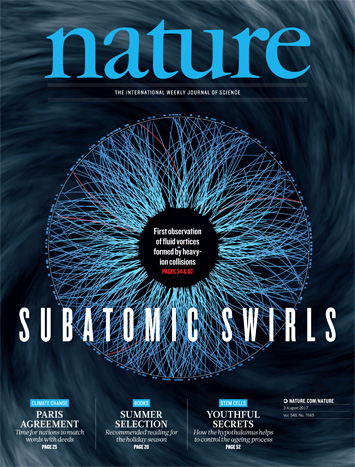

# Overview

:::::::::::::: {.columns align=center}
::: {.column width="40%"}
[Original Article][amano2023]

- About the methods
- About the results
- Outlook?

:::
::: {.column width="60%"}
{height=70%}
:::
::::::::::::::

<!-- - footline=authorinstitutetitle -->
<!-- In the realm of strongly-coupled systems, holography, has emerged as an invaluable tool for investigating hydrodynamical properties of strongly coupled fluids, like quark gluon plasmas. Based on recent work, this talk will present the findings about properties of strongly-coupled rotating fluids found with holography. The methods used will also be presented. In particular, we use a spinning black hole background in 5D AdS, AdS Myers-Perry black holes, as the gravitational dual of some strongly-coupled rotating fluid. As such, we have results of the field theory side (fluid results) and results of the gravity side. The fluid results cover findings pertaining to the unique features of the hydrodynamic and non-hydrodynamic regimes. This includes applicability of hydrodynamics at large temperatures and the effect of rotation on non-hydrodynamic modes at all temperatures. Gravity results include a new look at the stability of the AdS Myers-Perry solution and the dynamics of linear gravitation perturbations. -->

# "Gravity Side"

\begin{equation}
    S = \frac 1{16\pi G_5} \int \sqrt{-g} (R - 2\Lambda) + S_{\text{ct}}
\end{equation}

where $\Lambda = - 6 / \ell^2$.

- Rotating AdS blackhole $\longleftrightarrow$ Rotating strongly-coupled fluid

Rotating black holes are axisymmetric

- 5D Myers Perry black hole: static and spherically symmetric: $\mathbb R \times SO(4)$
- **Break Spherical Symmetry:
    $\mathbb R \times ( SO(3)\times SO(3) )/\mathbb Z_2 
    \rightsquigarrow R \times SO(2)\times SO(2)$**
- 5D flat rotating black hole kerr: stationary and axiosymmetric: 
    $\mathbb R \times SO(2)\times SO(2)$

<!-- ::: notes -->
<!-- Stationary -->

<!-- : A time symmetric spacetime where there exists an everywhere time like unit timelike vector. -->
<!-- ::: -->

$SO(2)\times SO(2) \longrightarrow$ there are two axial angular momenta.

## 5D AdS Myers-Perry Black Hole

### 5D AdS Myers-Perry Black Hole ([Hawking et al. 1998][hawking1998])

\begin{align}\label{eq:MP_Black_Hole}
ds^2&=\frac{\left(1+r_H^2\ell^{-2}\right)}{\rho ^2 r_H^2} \left(a b \mathrm{d} t_H-\frac{b  \left(a^2+r_H^2\right) \sin ^2(\theta_H )}{\Xi_a}\mathrm{d} \phi_H-\frac{a  \left(b^2+r_H^2\right) \cos ^2(\theta_H )}{\Xi_b}\mathrm{d}\psi_H\right)^2 \nonumber\\
    &-\frac{\Delta_r}{\rho ^2} \left(\mathrm{d} t_H-\frac{ a \sin ^2(\theta_H )}{\Xi_a}\mathrm{d} \phi_H-\frac{b  \cos ^2(\theta_H )}{\Xi_b}\mathrm{d} \psi_H\right)^2 +\frac{ \rho ^2}{\Delta_\theta}\mathrm{d} \theta_H^2+\frac{ \rho ^2}{\Delta_r}\mathrm{d} r_H^2\nonumber\\
    &+\frac{\Delta_\theta \sin ^2(\theta_H )}{\rho ^2} \left(a \mathrm{d} t_H-\frac{ a^2+r_H^2}{\Xi_a}\mathrm{d} \phi_H\right)^2+\frac{\Delta_\theta \cos ^2(\theta_H )}{\rho ^2}  \left(b \mathrm{d} t_H-\frac{ b^2+r_H^2}{\Xi_b}\mathrm{d} \psi_H\right)^2
\end{align}

- Cooridnates $(t_H, \theta_H, \phi_H, \psi_H, r_H)$
- Angular momentum parameters of $a$ and $b$.

-------------------------

Simply Spinning
: Enhance the symmetry with a certain subset of variables $a=b$.

\begin{equation}\label{eq:Simple_Spin_MP_Metric}
\begin{aligned}
    d s^2=\frac{{dr}^2}{G(r)}-dt^2 \left(\frac{r^2}{\ell^2}+1\right)+\frac{1}{4} r^2 \left((\sigma^1)^2+(\sigma^2)^2+(\sigma^3)^2\right) \\ +\frac{2 \mu  }{r^2} \left(\frac{a \sigma^3}{2}+dt\right)^2
\end{aligned}
\end{equation}

- Cooridnates: $(t, \theta, \phi, \psi, r)$
- Angular momentum parameter of $a$
- Enhanced Symmetry $SO(2)\times SO(2)\nearrow SO(3)\times SO(2)$
- $\sigma$'s are the left-invariant form of $SO(3)$.

## Gravitational Perturbations

\eqref{eq:pertgeneric} is the approximation of a perturbed metric to first order.

\begin{align}\label{eq:pertgeneric}
        g^{p}_{\mu\nu} {dx}^\mu {dx}^\nu = \left(g_{\mu\nu}+\epsilon~h_{\mu\nu}+O(\epsilon^2)\right) {dx}^\mu {dx}^\nu\,,
\end{align}

\eqref{eq:pertgeneric} ([Wald 1984][wald1984]) are linear PDEs.

\begin{align}\label{eq:pertgenericeom}
       -\frac{1}{2}\nabla_\mu \nabla_\nu h-\frac{1}{2}\nabla^\lambda \nabla_\lambda h_{\mu\nu}+\nabla^\lambda \nabla_{(\mu}h_{\nu)\lambda} = \frac{2\Lambda}{D-2}h_{\mu\nu}\,,
\end{align}

---------------------------------------

The enhanced symmetry can be used reduce the \eqref{eq:pertgenericeom} to ODEs wih \eqref{eq:Dual_Vectors_SU_2} and \eqref{eq:kvfsu2}.

\begin{align}\label{eq:Dual_Vectors_SU_2}
  \sigma_1 & = -\sin{\psi}\,\partial_\theta + \frac{\cos{\psi}}{\sin{\theta}}\,\partial_\phi - \cos{\theta} \sin{\phi}\,\partial_\psi\, ,\nonumber\\
    \sigma_2 & = \cos{\psi}\,\partial_\theta + \frac{\sin{\psi}}{\sin{\theta}}\,\partial_\phi - \cot{\theta} \sin{\psi}\,\partial_\psi\, ,\\
    \sigma_3 & = \partial_\psi\nonumber
\end{align}

\begin{align}  \label{eq:kvfsu2}
   \xi_3 & = \partial_\phi
\end{align}

We can defined operators of scalar fields/functions $L_a := i \sigma_a$ 
and $W_a := \xi_a$. The Casimir operator can be written out as $L^2 = L_aL_a$.

---------------------------------------

We can now construct the to be angular parts of the perturbation with a compatible subset of these operators which obey some given eigenvalue problems, $L^2, L_3, W_3$.

\begin{align}\label{eq:wigeigenequations}
   L^2 D^\mathcal{J}_{\mathcal{KM}}&=\mathcal{J}(\mathcal{J}+1)D^\mathcal{J}_{\mathcal{KM}}\nonumber\\
    L_3D^\mathcal{J}_{\mathcal{KM}}&=\mathcal{M} D^\mathcal{J}_{\mathcal{KM}}\\
    W_3 D^\mathcal{J}_{\mathcal{KM}}&=\mathcal{K} D^\mathcal{J}_{\mathcal{KM}}\nonumber
\end{align}

$L^2$ and $L_3$ are the angular momentum operators from undergraduate quantum.
One can use the raising and lowering operators built from these where $\sigma^\pm = \frac{1}{2} \left(\sigma^1 \mp i \sigma^2 \right)$ and  $\sigma_\pm  = \sigma_1 \pm i \sigma_2$.

$$\lsigma^i=(\exd t, \sigma^+,\sigma^-,\sigma^3,\exd r)$$

## Perturbation Sectors

\begin{equation}\label{eq:pertsimplygeneric}
    h_{\mu\nu} = \int d\omega e^{-i\omega t} \sum_{\mathcal{J} = 0} \sum_{\mathcal{M}=\mathcal{J}}^{\mathcal{J}} \sum_{\mathcal{K'}=-(\mathcal{J}+2)}^{\mathcal{J}+2} h_{i j}(r,\omega, \mathcal{J},\mathcal{M},\mathcal{K}') \lsigma^i_{\mu} \lsigma^j_{\nu} D_{\mathcal{K'}-Q(\lsigma^{i})-Q(\lsigma^{j}) \mathcal{M}}^\mathcal{J}
\end{equation}

$Q$ is the, $W_3$, angular momentum charge of the the **$i$**th basis.

\begin{equation*}
    Q(\lsigma^i) = 0 ~if~ i=r,t,3;\quad 1 ~if~ i=+;\quad -1 ~if~ i=- 
\end{equation*}

Plugging \eqref{eq:pertsimplygeneric} in to \eqref{eq:pertgeneric}:
- The perturbations of different $((\mathcal J, \mathcal M), \mathcal K')$ decouple
- The angular momentum quantum parameter, $\mathcal M$, does not appear in the equations.
- Perturbations are non-trivially labeled by $(\mathcal J, \mathcal K')$

## Tensor, Vector, and Scalar Sectors

Based on the "$(\mathcal J, \mathcal K')$" classification of sectors there are an infinite number of sectors.

[Our article][amano2023] takes a look at three of these sectors.

Tensor
: $\mathcal K' = \mathcal J + 2$

Vector
: $\mathcal K' = \mathcal J + 1$

Scalar
: $\mathcal K' = \mathcal J$

## Quasinormal Modes

The quasinormal modes (dual to retarted Greens) are defined as non-trivial solutions to \eqref{eq:pertgenericeom} and obey the two boundary conditions, ingoing at the horizon and sourceless at the AdS Boundary.

For a given sector:

- $\mathcal J = 0, 1/2, 1, 2, \ldots$ is the discrete (angular) momentum. 
- $\omega_{ \mathcal J }$ are discrete frequencies such that he BCs are fulfilled.

# "Field Theory Side"

GKP-Witten Relation ([Natuume 2014][natuume2014])
: $\left< \exp\left(i \int \phi^{(0)} \mathcal O\right) \right> = \exp\left(i \underbar S_{\phi=\phi^{(0)}} \right)$

This is the well know physics equation $Z_{gauge} = Z_{ads}$

$\mathcal O$ is the corresponding to the bulk field, $\phi$, and its boundry value, $\phi^{(0)}$.

We would like know about resonancing of field theory system corresponding to the rotating black hole.

Some text about the field theory side.

*Explain field theory*

## The Hydrodynamic Description

hydro hydro hydro

# Using the Duality

Lorem ipsum dolor sit amet, consetetur sadipscing elitr, sed diam nonumy eirmod tempor invidunt ut labore et dolore magna aliquyam erat, sed diam voluptua. At vero eos et accusam et justo duo dolores et ea rebum. Stet clita kasd gubergren, no sea takimata sanctus est Lorem ipsum dolor sit amet.

# Results

- Non-Hydrodynamic Modes and the effects non-extremal rotation.
    - Tensor
    - Vector
    - Scalar
- Cross Spectrum Comparison
- The Emergence of Hydrodynamics
<!-- TODO Explain low temperature -->
<!-- TODO Explain non-extremal rotation. -->
- Stability
<!-- TODO Needs a hydrodynamic result: use old result -->

## Non-Hydrodynamic Modes

Lorem ipsum dolor sit amet, consetetur sadipscing elitr, sed diam nonumy eirmod tempor invidunt ut labore et dolore magna aliquyam erat, sed diam voluptua. At vero eos et accusam et justo duo dolores et ea rebum. Stet clita kasd gubergren, no sea takimata sanctus est Lorem ipsum dolor sit amet.

## $\mathcal K = \mathcal J$ Tensor Fluctuations {.squeeze}

{ width=75% }

------------------------------

{ width=75% }

------------------------------

{ width=75% }

## $\mathcal K = \mathcal J - 1$ Vector Fluctuations

{ width=75% }

------------------------------

{ width=75% }

------------------------------

{ width=75% }

## $\mathcal K = \mathcal J - 2$ Scalar Fluctuations

{ width=75% }

------------------------------

{ width=75% }

------------------------------

{ width=75% }

## Cross Spectrum Comparisons

:::::::::::::: {.columns}
::: {.column width="50%"}
{ width=100% }
:::
::: {.column width="50%"}
{ width=100% }
:::
::::::::::::::

## The Emergence of Hydrodynamics

\begin{equation}
    \omega = v \mathcal J^\beta - i D \mathcal J^\alpha
\end{equation}

## Stability

Lorem ipsum dolor sit amet, consetetur sadipscing elitr, sed diam nonumy eirmod tempor invidunt ut labore et dolore magna aliquyam erat, sed diam voluptua. At vero eos et accusam et justo duo dolores et ea rebum. Stet clita kasd gubergren, no sea takimata sanctus est Lorem ipsum dolor sit amet.

## RFP (Read the Fantastic Paper!)

- Pole-Skipping
- Gravitational shockwaves
- Chaos
- Critical Points

# Conclusion

## Outlook

- Look to calculate with a more general parameter space where $\mathcal J_\phi\neq\mathcal J_\psi$ ($a\neq b$).
    - No "axis of rotation" in current background.
    - Need PDEs
- Different **sources** of rotation?
    - Vector graviton sourcing the rotation ~ $H_{\theta i} \sim \Omega_i r^2$
    - RN with magnetic field, $A_\theta \sim \Omega_i r^2$
- Linear instability in the dual field theory?
- be used in "hydro codes"
- and more...RFP!

## Acknowledgements

This research was conducted with funding from the _Postdoctoral Fellowship at Henan University_.

I would also like to thank collaborators, _Mathias_, _Casey_, and _Jackson_, on yet another fruitful endevour.

[hawking1998]:https://inspirehep.net/literature/478927
[amano2023]:https://arxiv.org/abs/2308.11686
[wald1984]:https://inspirehep.net/literature/209356 
[natuume2014]:https://inspirehep.net/literature/1316320
